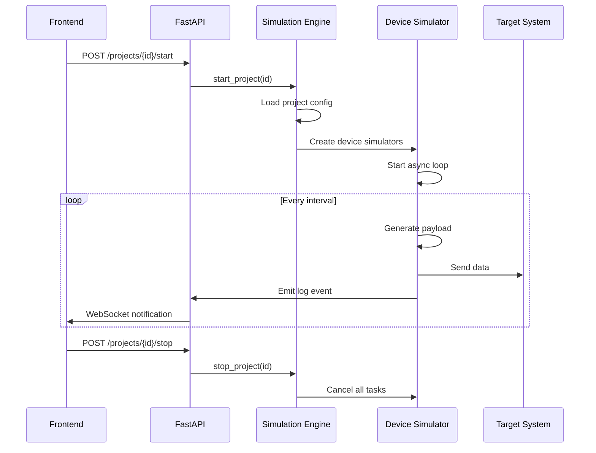

# Arquitectura del Simulador IoT

## 🏗️ Arquitectura General

### Patrón Arquitectónico Principal
**Clean Architecture + Repository Pattern** - Separación clara de responsabilidades y fácil testing

```
┌─────────────────────────────────────────────────────────────┐
│                      FRONTEND (React)                       │
│  ┌─────────────┐  ┌─────────────┐  ┌─────────────────────┐  │
│  │   Pages     │  │ Components  │  │      Services       │  │
│  │             │  │             │  │   (API Clients)     │  │
│  └─────────────┘  └─────────────┘  └─────────────────────┘  │
└─────────────────────────────────────────────────────────────┘
                              │
                         HTTP/WebSocket
                              │
┌─────────────────────────────────────────────────────────────┐
│                    BACKEND (FastAPI)                        │
│  ┌─────────────┐  ┌─────────────┐  ┌─────────────────────┐  │
│  │ Controllers │  │   Services  │  │    Repositories     │  │
│  │   (API)     │  │  (Business  │  │   (Data Access)     │  │
│  │             │  │    Logic)   │  │                     │  │
│  └─────────────┘  └─────────────┘  └─────────────────────┘  │
│                                                             │
│  ┌─────────────┐  ┌─────────────┐  ┌─────────────────────┐  │
│  │ Simulation  │  │   Target    │  │     Payload         │  │
│  │   Engine    │  │  Connectors │  │   Generators        │  │
│  └─────────────┘  └─────────────┘  └─────────────────────┘  │
└─────────────────────────────────────────────────────────────┘
                              │
                    ┌─────────┴─────────┐
                    │                   │
              ┌─────────────┐    ┌─────────────┐
              │   Config    │    │  Simulation │
              │ Storage     │    │   State     │
              │ (SQLite)    │    │ (In-Memory) │
              └─────────────┘    └─────────────┘
```

## 📁 Estructura del Proyecto

### Backend Structure
```
backend/
├── app/
│   ├── __init__.py
│   ├── main.py                 # FastAPI app setup
│   ├── core/
│   │   ├── config.py          # Settings & environment
│   │   ├── database.py        # Database connection
│   │   └── security.py        # Auth (future)
│   ├── api/
│   │   ├── __init__.py
│   │   ├── dependencies.py
│   │   └── v1/
│   │       ├── __init__.py
│   │       ├── projects.py    # Project endpoints
│   │       ├── devices.py     # Device endpoints
│   │       ├── payloads.py    # Payload endpoints
│   │       ├── targets.py     # Target system endpoints
│   │       └── simulation.py  # Simulation control
│   ├── models/
│   │   ├── __init__.py
│   │   ├── project.py         # Pydantic models
│   │   ├── device.py
│   │   ├── payload.py
│   │   └── target.py
│   ├── schemas/
│   │   ├── __init__.py
│   │   └── database.py        # SQLAlchemy models
│   ├── services/
│   │   ├── __init__.py
│   │   ├── project_service.py
│   │   ├── device_service.py
│   │   ├── payload_service.py
│   │   ├── target_service.py
│   │   └── simulation_service.py
│   ├── repositories/
│   │   ├── __init__.py
│   │   ├── base_repository.py
│   │   ├── project_repository.py
│   │   ├── device_repository.py
│   │   ├── payload_repository.py
│   │   └── target_repository.py
│   ├── simulation/
│   │   ├── __init__.py
│   │   ├── engine.py          # Simulation orchestrator
│   │   ├── device_simulator.py # Individual device logic
│   │   ├── payload_generators/
│   │   │   ├── __init__.py
│   │   │   ├── json_builder.py
│   │   │   └── python_runner.py
│   │   └── connectors/
│   │       ├── __init__.py
│   │       ├── base_connector.py
│   │       ├── mqtt_connector.py
│   │       ├── http_connector.py
│   │       ├── kafka_connector.py
│   │       └── websocket_connector.py
│   └── utils/
│       ├── __init__.py
│       ├── logger.py
│       └── validators.py
├── tests/
├── requirements.txt
└── Dockerfile
```

### Frontend Structure
```
frontend/
├── src/
│   ├── components/
│   │   ├── ui/                # shadcn components
│   │   ├── layout/
│   │   ├── projects/
│   │   ├── devices/
│   │   ├── payloads/
│   │   ├── targets/
│   │   └── simulation/
│   ├── pages/
│   │   ├── ProjectsPage.jsx
│   │   ├── ProjectDetailPage.jsx
│   │   ├── DevicesPage.jsx
│   │   ├── PayloadBuilderPage.jsx
│   │   ├── TargetSystemsPage.jsx
│   │   └── SimulationPage.jsx
│   ├── services/
│   │   ├── api.js
│   │   ├── projects.js
│   │   ├── devices.js
│   │   ├── payloads.js
│   │   ├── targets.js
│   │   └── simulation.js
│   ├── hooks/
│   │   ├── useProjects.js
│   │   ├── useDevices.js
│   │   ├── useSimulation.js
│   │   └── useWebSocket.js
│   ├── stores/              # Zustand for state management
│   │   ├── projectStore.js
│   │   ├── deviceStore.js
│   │   └── simulationStore.js
│   ├── utils/
│   └── types/
├── public/
├── package.json
└── Dockerfile
```

## 🔧 Componentes Clave

### 1. Simulation Engine (Corazón del Sistema)

**Patrón: Command + Observer**

```python
class SimulationEngine:
    """Orquestador principal de simulaciones"""
    
    def __init__(self):
        self.running_projects = {}  # project_id -> SimulationProject
        self.observers = []         # Para logs en tiempo real
    
    async def start_project(self, project_id: str):
        # Cargar configuración del proyecto
        # Crear SimulationProject
        # Iniciar todos los dispositivos
        pass
    
    async def stop_project(self, project_id: str):
        # Detener todas las tareas del proyecto
        # Limpiar recursos
        pass

class SimulationProject:
    """Representa un proyecto en ejecución"""
    
    def __init__(self, project_config):
        self.devices = []           # Lista de DeviceSimulator
        self.tasks = []            # Tareas asyncio
    
    async def start_all_devices(self):
        for device in self.devices:
            task = asyncio.create_task(device.run())
            self.tasks.append(task)

class DeviceSimulator:
    """Simula un dispositivo individual"""
    
    def __init__(self, device_config, payload_generator, connector):
        self.config = device_config
        self.payload_generator = payload_generator
        self.connector = connector
        self.running = False
    
    async def run(self):
        """Bucle principal del dispositivo"""
        while self.running:
            payload = await self.payload_generator.generate()
            await self.connector.send(payload)
            await asyncio.sleep(self.config.interval)
```

### 2. Payload Generators (Strategy Pattern)

```python
class PayloadGenerator(ABC):
    """Interfaz para generadores de payload"""
    
    @abstractmethod
    async def generate(self) -> dict:
        pass

class JsonBuilderGenerator(PayloadGenerator):
    """Generador basado en reglas visuales"""
    
    def __init__(self, schema: dict):
        self.schema = schema
    
    async def generate(self) -> dict:
        # Aplicar reglas del schema para generar JSON
        pass

class PythonCodeGenerator(PayloadGenerator):
    """Generador basado en código Python"""
    
    def __init__(self, code: str):
        self.code = code
        self.compiled_code = compile(code, '<string>', 'exec')
    
    async def generate(self) -> dict:
        # Ejecutar código de usuario de forma segura
        pass
```

### 3. Target Connectors (Strategy Pattern)

```python
class TargetConnector(ABC):
    """Interfaz para conectores de destino"""
    
    @abstractmethod
    async def send(self, payload: dict) -> bool:
        pass
    
    @abstractmethod
    async def connect(self) -> bool:
        pass
    
    @abstractmethod
    async def disconnect(self):
        pass

class MQTTConnector(TargetConnector):
    """Conector para brokers MQTT"""
    
    def __init__(self, config: MQTTConfig):
        self.config = config
        self.client = None
    
    async def send(self, payload: dict) -> bool:
        # Publicar mensaje MQTT
        pass

class HTTPConnector(TargetConnector):
    """Conector para endpoints HTTP"""
    
    def __init__(self, config: HTTPConfig):
        self.config = config
    
    async def send(self, payload: dict) -> bool:
        # Enviar POST request
        pass
```

### 4. Repository Pattern para Datos

```python
class BaseRepository(Generic[T]):
    """Repositorio base con operaciones CRUD"""
    
    def __init__(self, db_session):
        self.db = db_session
    
    async def create(self, entity: T) -> T:
        pass
    
    async def get_by_id(self, id: str) -> Optional[T]:
        pass
    
    async def get_all(self) -> List[T]:
        pass
    
    async def update(self, id: str, entity: T) -> T:
        pass
    
    async def delete(self, id: str) -> bool:
        pass

class ProjectRepository(BaseRepository[Project]):
    """Repositorio específico para proyectos"""
    
    async def get_with_devices(self, project_id: str) -> Optional[Project]:
        # Cargar proyecto con todos sus dispositivos
        pass
```

## 🚀 Tecnologías y Librerías

### Backend
- **FastAPI**: Framework web principal
- **SQLAlchemy + Alembic**: ORM y migraciones
- **SQLite**: Base de datos (MVP)
- **Pydantic**: Validación de datos
- **asyncio**: Programación asíncrona
- **paho-mqtt**: Cliente MQTT
- **aiohttp**: Cliente HTTP asíncrono
- **aiokafka**: Cliente Kafka asíncrono
- **websockets**: Soporte WebSocket
- **python-multipart**: Upload de archivos

### Frontend
- **React 18**: Framework UI
- **shadcn/ui**: Componentes UI
- **Tailwind CSS**: Estilos
- **Zustand**: State management
- **React Query**: Data fetching
- **React Hook Form**: Formularios
- **Monaco Editor**: Editor de código Python
- **Recharts**: Visualización de logs

## 📊 Flujo de Datos Principal



## 🔒 Consideraciones de Seguridad

### Ejecución de Código Python
```python
import ast
import sys
from types import CodeType

class SafePythonExecutor:
    """Ejecutor seguro de código Python del usuario"""
    
    ALLOWED_NAMES = {
        'random', 'datetime', 'uuid', 'math', 'json'
    }
    
    def validate_code(self, code: str) -> bool:
        """Valida que el código sea seguro"""
        try:
            tree = ast.parse(code)
            for node in ast.walk(tree):
                if isinstance(node, ast.Import):
                    # Validar imports permitidos
                    pass
                elif isinstance(node, ast.Call):
                    # Validar funciones permitidas
                    pass
            return True
        except:
            return False
    
    def execute(self, code: str, timeout: int = 5) -> dict:
        """Ejecuta código con timeout y sandboxing"""
        pass
```

## 📈 Escalabilidad y Performance

### Consideraciones Iniciales
1. **Async First**: Todo el pipeline de simulación es asíncrono
2. **Connection Pooling**: Reutilizar conexiones HTTP/MQTT/Kafka
3. **Batching**: Agrupar envíos cuando sea posible
4. **Resource Limits**: Limitar memoria y CPU por proyecto

### Métricas a Monitorear
- Dispositivos activos por proyecto
- Mensajes enviados por segundo
- Latencia promedio de envío
- Errores de conexión por target system

## 🐳 Despliegue con Docker

### docker-compose.yml
```yaml
version: '3.8'
services:
  backend:
    build: ./backend
    ports:
      - "8000:8000"
    environment:
      - DATABASE_URL=sqlite:///./data/app.db
    volumes:
      - ./data:/app/data
  
  frontend:
    build: ./frontend
    ports:
      - "3000:80"
    depends_on:
      - backend
  
  # Servicios opcionales para testing
  mosquitto:
    image: eclipse-mosquitto:2.0
    ports:
      - "1883:1883"
```

## 🔄 Plan de Implementación Iterativo

### Fase 1 (MVP Core)
1. Setup básico FastAPI + React
2. CRUD de Proyectos y Dispositivos
3. JSON Builder básico
4. HTTP Connector
5. Simulación simple (1 dispositivo)

### Fase 2 (Conectores)
1. MQTT Connector
2. WebSocket Connector
3. Simulación multi-dispositivo
4. Logs en tiempo real

### Fase 3 (Avanzado)
1. Python Code Generator
2. Kafka Connector
3. Target System management
4. Export/Import proyectos

### Fase 4 (Producción)
1. Autenticación de usuarios
2. Métricas y monitoring
3. Escalabilidad horizontal
4. Testing automatizado

Esta arquitectura te proporciona una base sólida, fácil de entender y perfecta para desarrollo iterativo con Vibe Coding. ¿Te gustaría que profundice en algún componente específico?