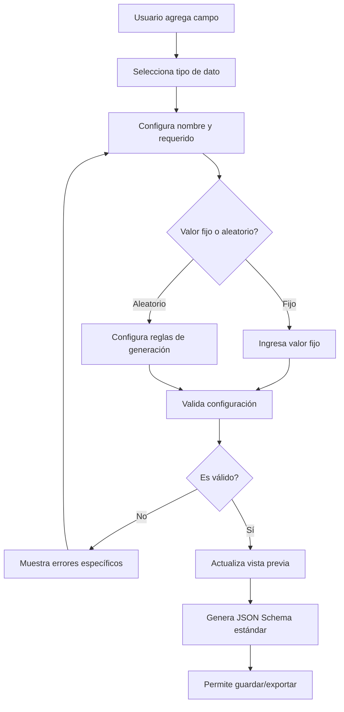

# Design Document - Simulador de Dispositivos IoT

## Overview

El simulador de dispositivos IoT es una aplicación web moderna que permite generar datos de telemetría sintéticos en tiempo real. La solución utiliza una arquitectura desacoplada con React en el frontend y FastAPI en el backend, diseñada para escalar desde unos pocos dispositivos hasta miles de simuladores concurrentes.

### Principios de Diseño

1. **Separación de Responsabilidades**: Frontend para UI/UX, Backend para lógica de negocio y simulación
2. **Escalabilidad Asíncrona**: Uso de asyncio para manejar miles de dispositivos concurrentes
3. **Flexibilidad de Datos**: Soporte tanto para generación visual como programática de payloads
4. **Streaming First**: No almacenamiento de telemetría, transmisión directa a destinos
5. **Containerización**: Despliegue completo con Docker para portabilidad
6. **Portabilidad**: expotación e importación de proyectos con todos sus dispositivos y payloads

## Architecture

### High-Level Architecture

```
┌─────────────────────────────────────────────────────────────┐
│                    FRONTEND (React)                         │
│  ┌─────────────┐  ┌─────────────┐  ┌─────────────────────┐  │
│  │   Pages     │  │ Components  │  │      Services       │  │
│  │             │  │             │  │   (API Clients)     │  │
│  └─────────────┘  └─────────────┘  └─────────────────────┘  │
└─────────────────────────────────────────────────────────────┘
                              │
                         HTTP/WebSocket
                              │
┌─────────────────────────────────────────────────────────────┐
│                    BACKEND (FastAPI)                        │
│  ┌─────────────┐  ┌─────────────┐  ┌─────────────────────┐  │
│  │ Controllers │  │   Services  │  │    Repositories     │  │
│  │   (API)     │  │  (Business  │  │   (Data Access)     │  │
│  │             │  │    Logic)   │  │                     │  │
│  └─────────────┘  └─────────────┘  └─────────────────────┘  │
│                                                             │
│  ┌─────────────┐  ┌─────────────┐  ┌─────────────────────┐  │
│  │ Simulation  │  │   Target    │  │     Payload         │  │
│  │   Engine    │  │  Connectors │  │   Generators        │  │
│  └─────────────┘  └─────────────┘  └─────────────────────┘  │
└─────────────────────────────────────────────────────────────┘
                              │
                    ┌─────────┴─────────┐
                    │                   │
              ┌─────────────┐    ┌─────────────┐
              │   Config    │    │  Simulation │
              │ Storage     │    │   State     │
              │ (SQLite)    │    │ (In-Memory) │
              └─────────────┘    └─────────────┘
```

### Technology Stack

**Frontend:**
- React 18 con hooks y functional components
- shadcn/ui para componentes UI consistentes
- Tailwind CSS para estilos utilitarios
- Zustand para state management ligero
- React Query para data fetching y cache
- Monaco Editor para editor de código Python
- WebSocket client para actualizaciones en tiempo real

**Backend:**
- FastAPI para APIs REST de alto rendimiento
- SQLAlchemy + Alembic para ORM y migraciones
- SQLite para persistencia de configuración (MVP)
- Pydantic para validación de datos
- asyncio para programación asíncrona
- Librerías específicas: paho-mqtt, aiohttp, aiokafka, websockets

## JSON Schema Builder Architecture

### Visual Schema Editor Design

El JSON Schema Builder es el componente central para la definición de payloads. Utiliza una arquitectura modular que permite:

1. **Construcción Visual**: Interfaz drag-and-drop para crear esquemas sin código
2. **Validación en Tiempo Real**: Validación inmediata usando Ajv
3. **Vista Previa Dinámica**: Generación de JSON Schema estándar en tiempo real
4. **Generación de Muestras**: Creación de datos de ejemplo basados en reglas
5. **Persistencia Flexible**: Guardado como plantillas reutilizables

### Schema Builder Flow



### Field Type Mapping

| Tipo Visual | JSON Schema Type | Reglas Soportadas |
|-------------|------------------|-------------------|
| string | string | pattern, minLength, maxLength |
| integer | integer | minimum, maximum, multipleOf |
| float | number | minimum, maximum, multipleOf |
| boolean | boolean | N/A |
| date | string (format: date) | minDate, maxDate |
| datetime | string (format: date-time) | minDate, maxDate |
| object | object | properties, required |
| array | array | items, minItems, maxItems |

## Components and Interfaces

### Frontend Components

#### 1. Project Management
```typescript
interface Project {
  id: string;
  name: string;
  description?: string;
  created_at: string;
  updated_at: string;
  devices: Device[];
  is_running: boolean;
}

// Componentes principales
- ProjectList: Lista de proyectos con acciones CRUD
- ProjectForm: Formulario para crear/editar proyectos
- ProjectDetail: Vista detallada con dispositivos y configuración
- ProjectExport: Modal para exportar proyectos
```

#### 2. Device Configuration
```typescript
interface Device {
  id: string;
  project_id: string;
  name: string;
  metadata: Record<string, any>;
  payload_id: string;
  target_system_id: string;
  send_interval: number; // segundos
  is_enabled: boolean;
}

// Componentes principales
- DeviceList: Lista de dispositivos por proyecto
- DeviceForm: Formulario de configuración de dispositivo
- DeviceMetadataEditor: Editor de metadata personalizada
```

#### 3. JSON Schema Builder
```typescript
interface JSONSchemaField {
  id: string;
  name: string;
  type: 'string' | 'integer' | 'float' | 'boolean' | 'date' | 'datetime' | 'object' | 'array';
  required: boolean;
  valueType: 'fixed' | 'random';
  fixedValue?: any;
  randomRules?: RandomRules;
  children?: JSONSchemaField[]; // Para objetos anidados
  arrayItemType?: JSONSchemaField; // Para arrays
  defaultValue?: any;
  description?: string;
}

interface RandomRules {
  // Para strings
  pattern?: string;
  minLength?: number;
  maxLength?: number;
  
  // Para números
  minimum?: number;
  maximum?: number;
  multipleOf?: number;
  exclusiveMinimum?: boolean;
  exclusiveMaximum?: boolean;
  
  // Para arrays
  minItems?: number;
  maxItems?: number;
  
  // Para fechas
  minDate?: Date;
  maxDate?: Date;
}

interface JSONSchemaTemplate {
  id: string;
  name: string;
  description?: string;
  category?: string;
  schema: JSONSchemaField[];
  createdAt: Date;
  updatedAt: Date;
}

// Componentes principales del JSON Schema Builder
- JSONSchemaBuilder: Componente principal con drag-and-drop
- FieldConfigPanel: Panel de configuración de campos individuales
- FieldTypeSelector: Selector de tipos de datos con iconos
- ValueConfigurationPanel: Panel para configurar valores fijos vs aleatorios
- RandomRulesEditor: Editor específico para reglas de generación aleatoria
- NestedObjectEditor: Editor para objetos anidados con recursión
- ArrayItemEditor: Editor para definir tipos de elementos de arrays
- SchemaPreview: Vista previa del JSON Schema en tiempo real
- SchemaValidator: Validador usando Ajv con mensajes de error específicos
- SampleDataGenerator: Generador de datos de muestra basado en el esquema
- SchemaImportExport: Componente para importar/exportar JSON Schema
- FieldDuplicator: Utilidad para duplicar campos existentes
- SchemaTemplateManager: Gestor de plantillas y categorización
- PythonCodeEditor: Editor Monaco integrado como alternativa
```

#### 4. Target Systems
```typescript
interface TargetSystem {
  id: string;
  name: string;
  type: 'mqtt' | 'http' | 'kafka' | 'websocket' | 'ftp' | 'pubsub';
  config: TargetConfig;
}

// Configuraciones específicas por tipo
interface MQTTConfig {
  host: string;
  port: number;
  topic: string;
  username?: string;
  password?: string;
  use_tls: boolean;
}

// Componentes principales
- TargetSystemList: Lista de sistemas configurados
- TargetSystemForm: Formulario dinámico según tipo
- ConnectionTester: Prueba de conectividad
```

#### 5. Simulation Control
```typescript
interface SimulationStatus {
  project_id: string;
  is_running: boolean;
  active_devices: number;
  messages_sent: number;
  last_activity: string;
  errors: SimulationError[];
}

// Componentes principales
- SimulationDashboard: Panel de control principal
- DeviceStatusGrid: Estado de dispositivos individuales
- LogViewer: Visualización de logs en tiempo real
- SimulationControls: Botones start/stop/pause
```

### JSON Schema Builder APIs

```python
# API Endpoints para JSON Schema Builder
@router.post("/api/schema/validate")
async def validate_json_schema(request: JSONSchemaValidationRequest) -> JSONSchemaValidationResponse:
    """Valida campos de esquema y retorna JSON Schema estándar"""
    
@router.post("/api/schema/generate-sample")
async def generate_sample_data(request: SampleDataGenerationRequest) -> SampleDataGenerationResponse:
    """Genera datos de muestra basados en el esquema"""
    
@router.post("/api/schema/convert-to-standard")
async def convert_to_standard_schema(schema_fields: List[JSONSchemaFieldModel]) -> Dict[str, Any]:
    """Convierte esquema visual a JSON Schema estándar"""
    
@router.post("/api/schema/import-standard")
async def import_standard_schema(json_schema: Dict[str, Any]) -> List[JSONSchemaFieldModel]:
    """Importa JSON Schema estándar y convierte a formato visual"""
    
@router.get("/api/schema/templates")
async def list_schema_templates(
    category: Optional[str] = None,
    skip: int = 0,
    limit: int = 100
) -> List[JSONSchemaTemplateResponse]:
    """Lista plantillas de esquemas con filtros opcionales"""
    
@router.post("/api/schema/templates")
async def create_schema_template(template: JSONSchemaTemplateCreate) -> JSONSchemaTemplateResponse:
    """Crea nueva plantilla de esquema"""
    
@router.get("/api/schema/templates/{template_id}")
async def get_schema_template(template_id: str) -> JSONSchemaTemplateResponse:
    """Obtiene detalles de una plantilla específica"""
    
@router.put("/api/schema/templates/{template_id}")
async def update_schema_template(
    template_id: str, 
    template: JSONSchemaTemplateUpdate
) -> JSONSchemaTemplateResponse:
    """Actualiza plantilla existente"""
    
@router.delete("/api/schema/templates/{template_id}")
async def delete_schema_template(template_id: str) -> Dict[str, str]:
    """Elimina plantilla de esquema"""
    
@router.get("/api/schema/templates/categories")
async def list_template_categories() -> List[str]:
    """Lista categorías disponibles de plantillas"""
```

### Backend Services

#### 1. Simulation Engine
```python
class SimulationEngine:
    """Orquestador principal de simulaciones"""
    
    def __init__(self):
        self.running_projects: Dict[str, SimulationProject] = {}
        self.observers: List[SimulationObserver] = []
    
    async def start_project(self, project_id: str) -> bool:
        """Inicia simulación de un proyecto"""
        
    async def stop_project(self, project_id: str) -> bool:
        """Detiene simulación de un proyecto"""
        
    async def get_project_status(self, project_id: str) -> SimulationStatus:
        """Obtiene estado actual de simulación"""

class SimulationProject:
    """Representa un proyecto en ejecución"""
    
    def __init__(self, project_config: Project):
        self.config = project_config
        self.device_simulators: List[DeviceSimulator] = []
        self.tasks: List[asyncio.Task] = []
        self.is_running = False
    
    async def start_all_devices(self):
        """Inicia todos los dispositivos del proyecto"""
        
    async def stop_all_devices(self):
        """Detiene todos los dispositivos del proyecto"""
```

#### 2. Device Simulator
```python
class DeviceSimulator:
    """Simula un dispositivo IoT individual"""
    
    def __init__(
        self,
        device_config: Device,
        payload_generator: PayloadGenerator,
        target_connector: TargetConnector
    ):
        self.config = device_config
        self.payload_generator = payload_generator
        self.connector = target_connector
        self.is_running = False
        self.stats = DeviceStats()
    
    async def run(self):
        """Bucle principal del dispositivo"""
        while self.is_running:
            try:
                # Generar payload
                payload = await self.payload_generator.generate(
                    device_metadata=self.config.metadata
                )
                
                # Enviar a destino
                success = await self.connector.send(payload)
                
                # Actualizar estadísticas
                self.stats.update(success)
                
                # Notificar observers
                await self._notify_observers(payload, success)
                
                # Esperar intervalo
                await asyncio.sleep(self.config.send_interval)
                
            except Exception as e:
                await self._handle_error(e)
```

#### 3. JSON Schema Payload Generators
```python
class PayloadGenerator(ABC):
    """Interfaz base para generadores de payload"""
    
    @abstractmethod
    async def generate(self, device_metadata: Dict = None) -> Dict:
        """Genera un payload JSON"""
        pass

class JSONSchemaPayloadGenerator(PayloadGenerator):
    """Generador basado en JSON Schema visual"""
    
    def __init__(self, schema_fields: List[JSONSchemaField]):
        self.schema_fields = schema_fields
        self.field_generators = self._build_field_generators()
        self.validator = self._create_validator()
    
    def _build_field_generators(self) -> Dict[str, FieldGenerator]:
        """Construye generadores específicos para cada campo"""
        generators = {}
        
        for field in self.schema_fields:
            if field.valueType == 'fixed':
                generators[field.name] = FixedValueGenerator(field.fixedValue)
            else:
                generators[field.name] = self._create_random_generator(field)
        
        return generators
    
    def _create_random_generator(self, field: JSONSchemaField) -> FieldGenerator:
        """Crea generador aleatorio según tipo y reglas"""
        if field.type == 'string':
            return StringGenerator(
                pattern=field.randomRules.pattern,
                min_length=field.randomRules.minLength,
                max_length=field.randomRules.maxLength
            )
        elif field.type in ['integer', 'float']:
            return NumberGenerator(
                minimum=field.randomRules.minimum,
                maximum=field.randomRules.maximum,
                multiple_of=field.randomRules.multipleOf,
                is_integer=(field.type == 'integer')
            )
        elif field.type == 'boolean':
            return BooleanGenerator()
        elif field.type in ['date', 'datetime']:
            return DateTimeGenerator(
                min_date=field.randomRules.minDate,
                max_date=field.randomRules.maxDate,
                include_time=(field.type == 'datetime')
            )
        elif field.type == 'object':
            return ObjectGenerator(field.children)
        elif field.type == 'array':
            return ArrayGenerator(
                item_generator=self._create_random_generator(field.arrayItemType),
                min_items=field.randomRules.minItems,
                max_items=field.randomRules.maxItems
            )
    
    async def generate(self, device_metadata: Dict = None) -> Dict:
        """Genera payload según esquema JSON definido"""
        result = {}
        
        for field in self.schema_fields:
            if field.required or random.choice([True, False]):
                generator = self.field_generators[field.name]
                result[field.name] = await generator.generate()
            elif field.defaultValue is not None:
                result[field.name] = field.defaultValue
        
        # Sobrescribir con metadata del dispositivo si aplica
        if device_metadata:
            result.update(device_metadata)
        
        # Validar resultado contra JSON Schema
        if not self.validator.validate(result):
            raise PayloadValidationError(self.validator.errors)
            
        return result

class StringGenerator(FieldGenerator):
    """Generador para campos string con reglas específicas"""
    
    def __init__(self, pattern: str = None, min_length: int = 1, max_length: int = 50):
        self.pattern = pattern
        self.min_length = min_length
        self.max_length = max_length
        self.regex_generator = None
        
        if pattern:
            import rstr
            self.regex_generator = rstr
    
    async def generate(self) -> str:
        if self.pattern and self.regex_generator:
            # Generar string que coincida con el patrón regex
            return self.regex_generator.xeger(self.pattern)
        else:
            # Generar string aleatorio de longitud específica
            import string
            length = random.randint(self.min_length, self.max_length)
            return ''.join(random.choices(
                string.ascii_letters + string.digits, 
                k=length
            ))

class NumberGenerator(FieldGenerator):
    """Generador para campos numéricos con restricciones"""
    
    def __init__(
        self, 
        minimum: float = None, 
        maximum: float = None,
        multiple_of: float = None,
        is_integer: bool = False
    ):
        self.minimum = minimum or 0
        self.maximum = maximum or 100
        self.multiple_of = multiple_of
        self.is_integer = is_integer
    
    async def generate(self) -> Union[int, float]:
        if self.is_integer:
            value = random.randint(int(self.minimum), int(self.maximum))
        else:
            value = random.uniform(self.minimum, self.maximum)
        
        if self.multiple_of:
            value = round(value / self.multiple_of) * self.multiple_of
        
        return int(value) if self.is_integer else value

class ObjectGenerator(FieldGenerator):
    """Generador para objetos anidados"""
    
    def __init__(self, children: List[JSONSchemaField]):
        self.children = children
        self.child_generator = JSONSchemaPayloadGenerator(children)
    
    async def generate(self) -> Dict:
        return await self.child_generator.generate()

class ArrayGenerator(FieldGenerator):
    """Generador para arrays con elementos tipados"""
    
    def __init__(
        self, 
        item_generator: FieldGenerator,
        min_items: int = 1,
        max_items: int = 5
    ):
        self.item_generator = item_generator
        self.min_items = min_items
        self.max_items = max_items
    
    async def generate(self) -> List:
        count = random.randint(self.min_items, self.max_items)
        items = []
        
        for _ in range(count):
            item = await self.item_generator.generate()
            items.append(item)
        
        return items

class PythonPayloadGenerator(PayloadGenerator):
    """Generador basado en código Python personalizado"""
    
    def __init__(self, python_code: str):
        self.code = python_code
        self.executor = SafePythonExecutor()
    
    async def generate(self, device_metadata: Dict = None) -> Dict:
        """Ejecuta código Python del usuario en entorno seguro"""
        context = {
            'device_metadata': device_metadata or {},
            'datetime': datetime,
            'random': random,
            'uuid': uuid,
            'math': math,
            'faker': faker,  # Para generar datos realistas
            'time': time
        }
        
        return await self.executor.execute(self.code, context)

class JSONSchemaValidator:
    """Validador de JSON Schema usando Ajv"""
    
    def __init__(self, schema_fields: List[JSONSchemaField]):
        self.schema = self._build_json_schema(schema_fields)
        self.validator = self._create_ajv_validator()
    
    def _build_json_schema(self, fields: List[JSONSchemaField]) -> Dict:
        """Convierte campos visuales a JSON Schema estándar"""
        properties = {}
        required = []
        
        for field in fields:
            field_schema = self._field_to_json_schema(field)
            properties[field.name] = field_schema
            
            if field.required:
                required.append(field.name)
        
        return {
            "$schema": "http://json-schema.org/draft-07/schema#",
            "type": "object",
            "properties": properties,
            "required": required
        }
    
    def _field_to_json_schema(self, field: JSONSchemaField) -> Dict:
        """Convierte un campo visual a definición JSON Schema"""
        schema = {"type": self._map_type(field.type)}
        
        # Agregar restricciones según las reglas
        if field.randomRules:
            rules = field.randomRules
            
            if field.type == 'string':
                if rules.pattern:
                    schema["pattern"] = rules.pattern
                if rules.minLength:
                    schema["minLength"] = rules.minLength
                if rules.maxLength:
                    schema["maxLength"] = rules.maxLength
            
            elif field.type in ['integer', 'float']:
                if rules.minimum is not None:
                    schema["minimum"] = rules.minimum
                if rules.maximum is not None:
                    schema["maximum"] = rules.maximum
                if rules.multipleOf:
                    schema["multipleOf"] = rules.multipleOf
            
            elif field.type == 'array':
                if rules.minItems:
                    schema["minItems"] = rules.minItems
                if rules.maxItems:
                    schema["maxItems"] = rules.maxItems
                if field.arrayItemType:
                    schema["items"] = self._field_to_json_schema(field.arrayItemType)
        
        # Agregar objetos anidados
        if field.type == 'object' and field.children:
            nested_properties = {}
            nested_required = []
            
            for child in field.children:
                nested_properties[child.name] = self._field_to_json_schema(child)
                if child.required:
                    nested_required.append(child.name)
            
            schema["properties"] = nested_properties
            if nested_required:
                schema["required"] = nested_required
        
        # Agregar valor por defecto
        if field.defaultValue is not None:
            schema["default"] = field.defaultValue
        
        # Agregar descripción
        if field.description:
            schema["description"] = field.description
        
        return schema
    
    def _map_type(self, field_type: str) -> str:
        """Mapea tipos visuales a tipos JSON Schema"""
        type_mapping = {
            'string': 'string',
            'integer': 'integer',
            'float': 'number',
            'boolean': 'boolean',
            'date': 'string',
            'datetime': 'string',
            'object': 'object',
            'array': 'array'
        }
        return type_mapping.get(field_type, 'string')
    
    def validate(self, data: Dict) -> bool:
        """Valida datos contra el esquema"""
        return self.validator.validate(data)
    
    @property
    def errors(self) -> List[Dict]:
        """Retorna errores de validación detallados"""
        return self.validator.errors if hasattr(self.validator, 'errors') else []
```

#### 4. Target Connectors
```python
class TargetConnector(ABC):
    """Interfaz base para conectores de destino"""
    
    @abstractmethod
    async def connect(self) -> bool:
        """Establece conexión con el destino"""
        pass
    
    @abstractmethod
    async def send(self, payload: Dict) -> bool:
        """Envía payload al destino"""
        pass
    
    @abstractmethod
    async def disconnect(self):
        """Cierra conexión"""
        pass

class MQTTConnector(TargetConnector):
    """Conector para brokers MQTT"""
    
    def __init__(self, config: MQTTConfig):
        self.config = config
        self.client = None
    
    async def connect(self) -> bool:
        """Conecta al broker MQTT"""
        self.client = mqtt.Client()
        
        if self.config.username:
            self.client.username_pw_set(
                self.config.username, 
                self.config.password
            )
        
        if self.config.use_tls:
            self.client.tls_set()
        
        await self.client.connect(self.config.host, self.config.port)
        return True
    
    async def send(self, payload: Dict) -> bool:
        """Publica mensaje en tópico MQTT"""
        message = json.dumps(payload)
        result = self.client.publish(self.config.topic, message)
        return result.rc == mqtt.MQTT_ERR_SUCCESS

class HTTPConnector(TargetConnector):
    """Conector para endpoints HTTP/HTTPS"""
    
    def __init__(self, config: HTTPConfig):
        self.config = config
        self.session = None
    
    async def connect(self) -> bool:
        """Inicializa sesión HTTP"""
        self.session = aiohttp.ClientSession(
            headers=self.config.headers,
            timeout=aiohttp.ClientTimeout(total=30)
        )
        return True
    
    async def send(self, payload: Dict) -> bool:
        """Envía POST request con payload"""
        try:
            async with self.session.post(
                self.config.url,
                json=payload
            ) as response:
                return response.status < 400
        except Exception:
            return False
```

## Data Models

### Database Schema (SQLAlchemy)

```python
class Project(Base):
    __tablename__ = "projects"
    
    id = Column(String, primary_key=True, default=lambda: str(uuid.uuid4()))
    name = Column(String, nullable=False, unique=True)
    description = Column(Text)
    created_at = Column(DateTime, default=datetime.utcnow)
    updated_at = Column(DateTime, default=datetime.utcnow, onupdate=datetime.utcnow)
    
    # Relaciones
    devices = relationship("Device", back_populates="project", cascade="all, delete-orphan")

class Device(Base):
    __tablename__ = "devices"
    
    id = Column(String, primary_key=True, default=lambda: str(uuid.uuid4()))
    project_id = Column(String, ForeignKey("projects.id"), nullable=False)
    name = Column(String, nullable=False)
    metadata = Column(JSON, default=dict)
    payload_id = Column(String, ForeignKey("payloads.id"))
    target_system_id = Column(String, ForeignKey("target_systems.id"))
    send_interval = Column(Integer, default=10)  # segundos
    is_enabled = Column(Boolean, default=True)
    
    # Relaciones
    project = relationship("Project", back_populates="devices")
    payload = relationship("Payload")
    target_system = relationship("TargetSystem")

class JSONSchemaTemplate(Base):
    __tablename__ = "json_schema_templates"
    
    id = Column(String, primary_key=True, default=lambda: str(uuid.uuid4()))
    name = Column(String, nullable=False)
    description = Column(Text)
    category = Column(String, default="general")
    schema_fields = Column(JSON, nullable=False)  # Lista de JSONSchemaField
    created_at = Column(DateTime, default=datetime.utcnow)
    updated_at = Column(DateTime, default=datetime.utcnow, onupdate=datetime.utcnow)

class Payload(Base):
    __tablename__ = "payloads"
    
    id = Column(String, primary_key=True, default=lambda: str(uuid.uuid4()))
    name = Column(String, nullable=False)
    type = Column(Enum(PayloadType), nullable=False)  # 'json_schema' | 'python'
    schema_fields = Column(JSON)  # Para tipo json_schema - Lista de JSONSchemaField
    python_code = Column(Text)  # Para tipo python
    template_id = Column(String, ForeignKey("json_schema_templates.id"), nullable=True)
    created_at = Column(DateTime, default=datetime.utcnow)
    updated_at = Column(DateTime, default=datetime.utcnow, onupdate=datetime.utcnow)
    
    # Relaciones
    template = relationship("JSONSchemaTemplate")

class TargetSystem(Base):
    __tablename__ = "target_systems"
    
    id = Column(String, primary_key=True, default=lambda: str(uuid.uuid4()))
    name = Column(String, nullable=False, unique=True)
    type = Column(Enum(TargetType), nullable=False)
    config = Column(JSON, nullable=False)
    created_at = Column(DateTime, default=datetime.utcnow)
```

### API Models (Pydantic)

```python
class ProjectCreate(BaseModel):
    name: str = Field(..., min_length=1, max_length=100)
    description: Optional[str] = None

class ProjectResponse(BaseModel):
    id: str
    name: str
    description: Optional[str]
    created_at: datetime
    updated_at: datetime
    devices: List[DeviceResponse] = []
    is_running: bool = False

class DeviceCreate(BaseModel):
    name: str = Field(..., min_length=1, max_length=100)
    metadata: Dict[str, Any] = Field(default_factory=dict)
    payload_id: str
    target_system_id: str
    send_interval: int = Field(default=10, ge=1, le=3600)
    is_enabled: bool = True

class JSONSchemaFieldModel(BaseModel):
    id: str
    name: str = Field(..., min_length=1, max_length=100)
    type: Literal['string', 'integer', 'float', 'boolean', 'date', 'datetime', 'object', 'array']
    required: bool = True
    valueType: Literal['fixed', 'random']
    fixedValue: Optional[Any] = None
    randomRules: Optional[RandomRulesModel] = None
    children: Optional[List['JSONSchemaFieldModel']] = None
    arrayItemType: Optional['JSONSchemaFieldModel'] = None
    defaultValue: Optional[Any] = None
    description: Optional[str] = None

class RandomRulesModel(BaseModel):
    # Para strings
    pattern: Optional[str] = None
    minLength: Optional[int] = Field(None, ge=0)
    maxLength: Optional[int] = Field(None, ge=1)
    
    # Para números
    minimum: Optional[float] = None
    maximum: Optional[float] = None
    multipleOf: Optional[float] = Field(None, gt=0)
    exclusiveMinimum: Optional[bool] = False
    exclusiveMaximum: Optional[bool] = False
    
    # Para arrays
    minItems: Optional[int] = Field(None, ge=0)
    maxItems: Optional[int] = Field(None, ge=1)
    
    # Para fechas
    minDate: Optional[datetime] = None
    maxDate: Optional[datetime] = None
    
    @validator('maxLength')
    def validate_max_length(cls, v, values):
        min_length = values.get('minLength')
        if min_length is not None and v is not None and v < min_length:
            raise ValueError('maxLength must be greater than or equal to minLength')
        return v
    
    @validator('maximum')
    def validate_maximum(cls, v, values):
        minimum = values.get('minimum')
        if minimum is not None and v is not None and v < minimum:
            raise ValueError('maximum must be greater than or equal to minimum')
        return v

class JSONSchemaTemplateCreate(BaseModel):
    name: str = Field(..., min_length=1, max_length=100)
    description: Optional[str] = None
    category: str = Field(default="general", max_length=50)
    schema_fields: List[JSONSchemaFieldModel]
    
    @validator('schema_fields')
    def validate_schema_fields(cls, v):
        if not v:
            raise ValueError('At least one schema field is required')
        return v

class PayloadCreate(BaseModel):
    name: str = Field(..., min_length=1, max_length=100)
    type: Literal['json_schema', 'python']
    schema_fields: Optional[List[JSONSchemaFieldModel]] = None
    python_code: Optional[str] = None
    template_id: Optional[str] = None
    
    @validator('schema_fields')
    def validate_schema_fields(cls, v, values):
        if values.get('type') == 'json_schema' and not v:
            raise ValueError('Schema fields are required for JSON Schema payloads')
        return v
    
    @validator('python_code')
    def validate_python_code(cls, v, values):
        if values.get('type') == 'python' and not v:
            raise ValueError('Python code is required for Python payloads')
        return v

class JSONSchemaValidationRequest(BaseModel):
    schema_fields: List[JSONSchemaFieldModel]

class JSONSchemaValidationResponse(BaseModel):
    is_valid: bool
    errors: List[Dict[str, Any]] = []
    json_schema: Optional[Dict[str, Any]] = None

class SampleDataGenerationRequest(BaseModel):
    schema_fields: List[JSONSchemaFieldModel]
    count: int = Field(default=1, ge=1, le=10)

class SampleDataGenerationResponse(BaseModel):
    samples: List[Dict[str, Any]]
```

## Error Handling

### Error Categories

1. **Validation Errors**: Datos de entrada inválidos
2. **Connection Errors**: Fallos de conectividad con destinos
3. **Execution Errors**: Errores en generación de payloads o envío
4. **System Errors**: Errores internos del sistema

### Error Response Format

```python
class ErrorResponse(BaseModel):
    error: str
    message: str
    details: Optional[Dict] = None
    timestamp: datetime = Field(default_factory=datetime.utcnow)

# Ejemplo de uso
@app.exception_handler(ValidationError)
async def validation_exception_handler(request: Request, exc: ValidationError):
    return JSONResponse(
        status_code=422,
        content=ErrorResponse(
            error="VALIDATION_ERROR",
            message="Invalid input data",
            details=exc.errors()
        ).dict()
    )
```

### Resilience Patterns

1. **Circuit Breaker**: Para conexiones a destinos externos
2. **Retry Logic**: Reintentos con backoff exponencial
3. **Timeout Handling**: Timeouts configurables por tipo de destino
4. **Graceful Degradation**: Continuar simulación aunque algunos dispositivos fallen

## Testing Strategy

### Unit Testing
- **Frontend**: Jest + React Testing Library para componentes
- **Backend**: pytest para servicios, repositorios y conectores
- **Payload Generators**: Tests para validar generación correcta
- **Target Connectors**: Tests con mocks para cada protocolo

### Integration Testing
- **API Endpoints**: Tests end-to-end de APIs REST
- **Database Operations**: Tests de persistencia y consultas
- **Simulation Engine**: Tests de orquestación completa
- **WebSocket Communication**: Tests de comunicación en tiempo real

### Performance Testing
- **Load Testing**: Simulación con miles de dispositivos
- **Memory Usage**: Monitoreo de uso de memoria durante simulación
- **Connection Pooling**: Eficiencia de reutilización de conexiones
- **Async Performance**: Medición de throughput asíncrono

### Security Testing
- **Python Code Execution**: Validación de sandboxing seguro
- **Input Validation**: Tests de inyección y datos maliciosos
- **Connection Security**: Validación de TLS/SSL en conectores
- **Authentication**: Tests de autenticación cuando se implemente

## Deployment Architecture

### Docker Configuration

```dockerfile
# Backend Dockerfile
FROM python:3.11-slim

WORKDIR /app

COPY requirements.txt .
RUN pip install --no-cache-dir -r requirements.txt

COPY . .

EXPOSE 8000

CMD ["uvicorn", "app.main:app", "--host", "0.0.0.0", "--port", "8000"]
```

```dockerfile
# Frontend Dockerfile
FROM node:18-alpine as build

WORKDIR /app
COPY package*.json ./
RUN npm ci

COPY . .
RUN npm run build

FROM nginx:alpine
COPY --from=build /app/dist /usr/share/nginx/html
COPY nginx.conf /etc/nginx/nginx.conf

EXPOSE 80
```

### Docker Compose

```yaml
version: '3.8'

services:
  backend:
    build: ./backend
    ports:
      - "8000:8000"
    environment:
      - DATABASE_URL=sqlite:///./data/app.db
      - CORS_ORIGINS=http://localhost:3000
    volumes:
      - ./data:/app/data
    healthcheck:
      test: ["CMD", "curl", "-f", "http://localhost:8000/health"]
      interval: 30s
      timeout: 10s
      retries: 3

  frontend:
    build: ./frontend
    ports:
      - "3000:80"
    depends_on:
      - backend
    environment:
      - REACT_APP_API_URL=http://localhost:8000

  # Servicios opcionales para desarrollo/testing
  mosquitto:
    image: eclipse-mosquitto:2.0
    ports:
      - "1883:1883"
      - "9001:9001"
    volumes:
      - ./mosquitto.conf:/mosquitto/config/mosquitto.conf

  kafka:
    image: confluentinc/cp-kafka:latest
    environment:
      KAFKA_ZOOKEEPER_CONNECT: zookeeper:2181
      KAFKA_ADVERTISED_LISTENERS: PLAINTEXT://localhost:9092
    ports:
      - "9092:9092"
    depends_on:
      - zookeeper

  zookeeper:
    image: confluentinc/cp-zookeeper:latest
    environment:
      ZOOKEEPER_CLIENT_PORT: 2181
    ports:
      - "2181:2181"
```

### Environment Configuration

```python
class Settings(BaseSettings):
    # Database
    database_url: str = "sqlite:///./data/app.db"
    
    # CORS
    cors_origins: List[str] = ["http://localhost:3000"]
    
    # Security
    secret_key: str = "your-secret-key-here"
    
    # Simulation limits
    max_devices_per_project: int = 1000
    max_concurrent_projects: int = 10
    
    # Performance
    connection_pool_size: int = 100
    request_timeout: int = 30
    
    class Config:
        env_file = ".env"
```

Este diseño proporciona una base sólida para implementar el simulador IoT con todas las funcionalidades requeridas, manteniendo flexibilidad para futuras extensiones y optimizaciones de rendimiento.